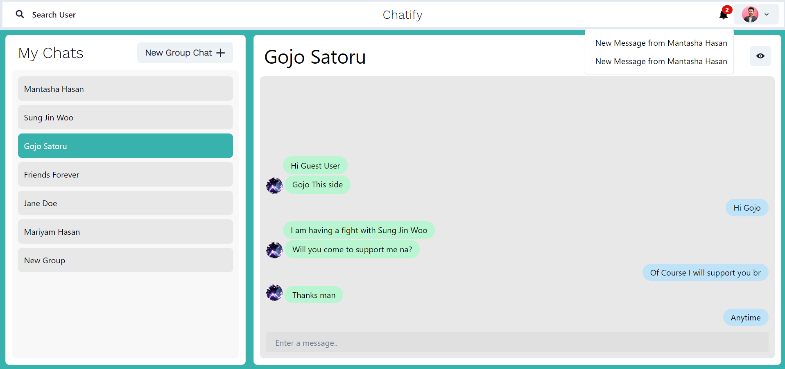
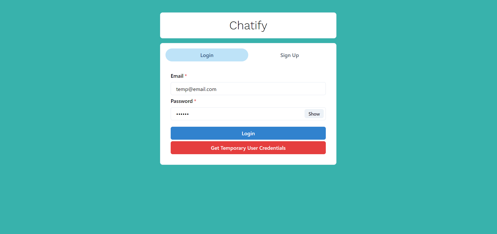
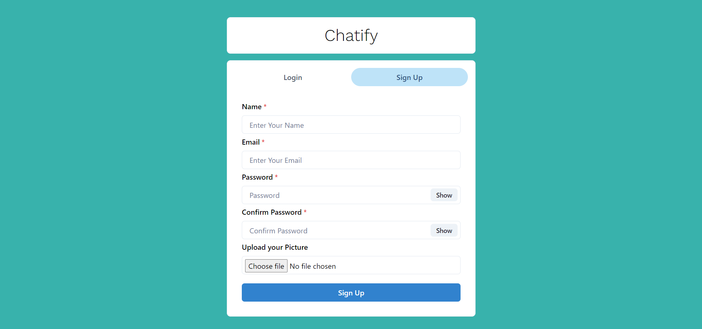
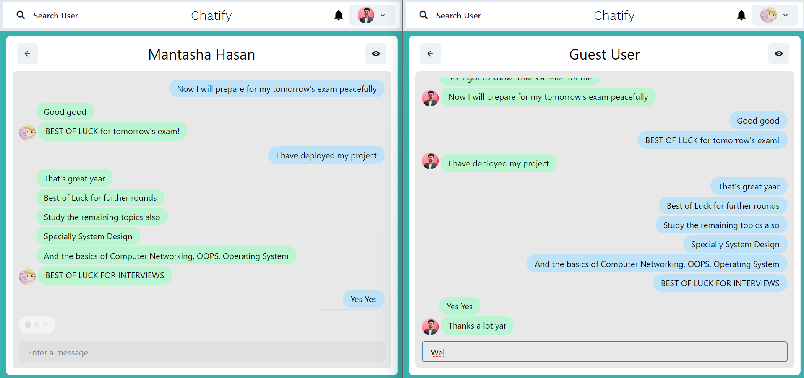
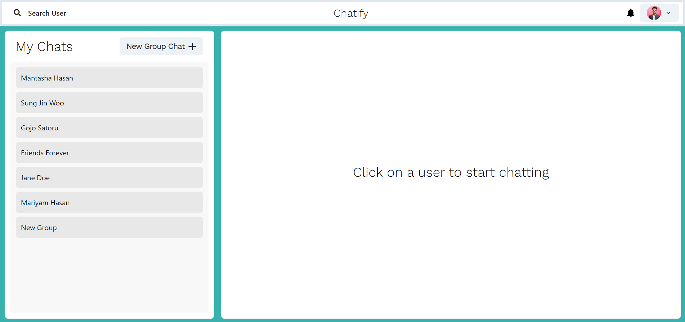
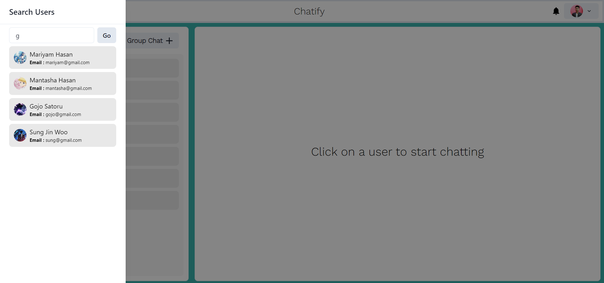
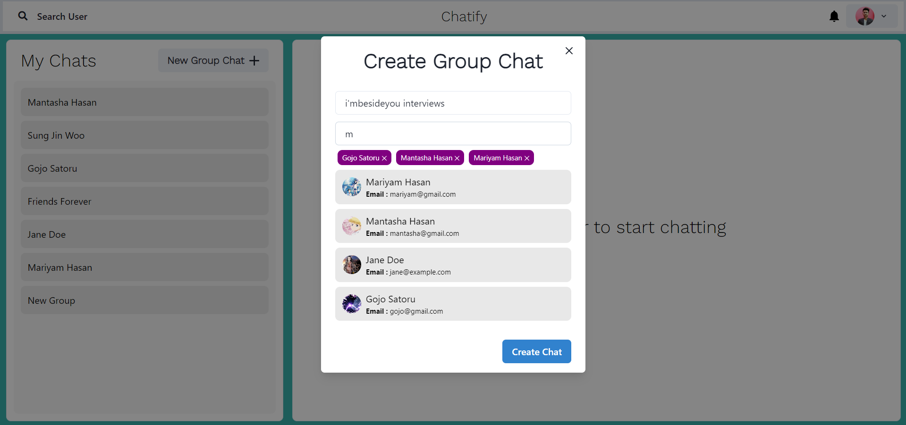
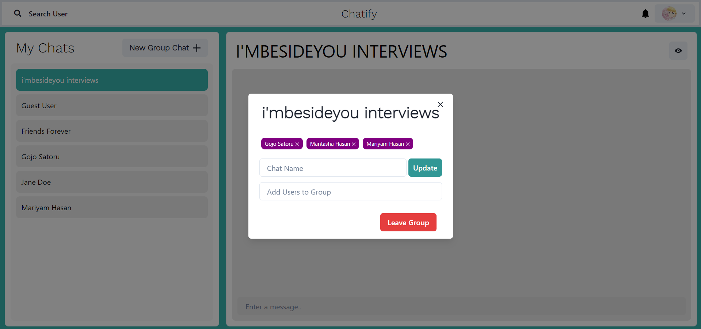
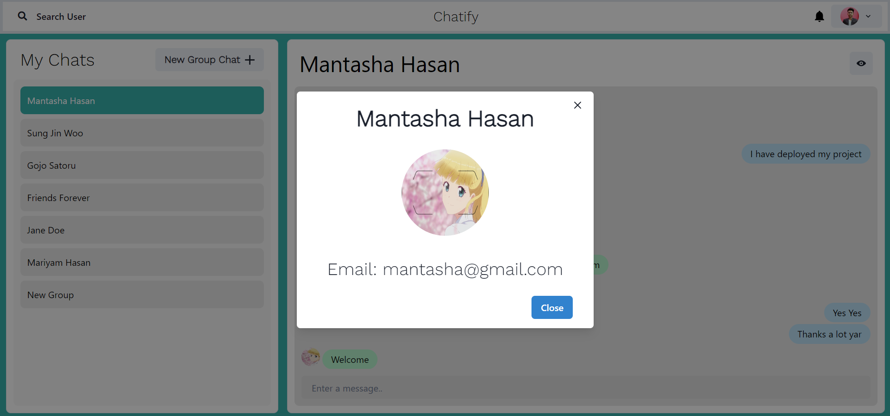

# Chat Realm

**Chat Realm** is a Full Stack Chatting App that uses **Socket.io** for real-time communication and stores user details in encrypted format in a **MongoDB** database.

## Tech Stack

- **Client**: React JS
- **Server**: Node JS, Express JS
- **Database**: MongoDB

## Demo



## Run Locally

 Clone the project

```bash
git clone https://github.com/ToushifAlam/chat-realm
```

Go to the project directory

```bash
cd chat-realm
```

Install dependencies

```bash
npm install
```

```bash
cd frontend/
npm install
```

Start the server

```bash
  npm run start
```

Start the Client

```bash
  //open now terminal
  cd frontend
  npm start
```

## Features

### 1. Authentication





- Secure user authentication and registration.

### 2. Real-Time Chatting with Typing Indicators



- Chat in real-time with typing indicators to show when others are typing.

### 3. One-to-One Chat



- Direct messaging between users.

### 4. Search Users



- Easily search for users to start new conversations.

### 5. Create Group Chats



- Create and manage group conversations.

### 6. Notifications


- Get real-time notifications for new messages and activity.

### 7. Add or Remove Users from Group



- Add or remove users from group chats at any time.

### 8. View Other User Profile



- View profiles of other users in the app.
